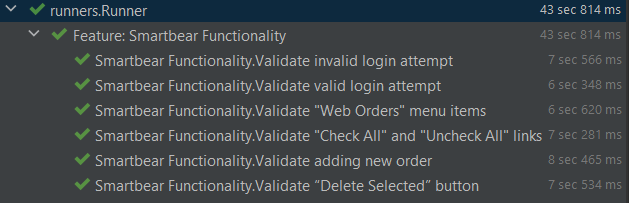
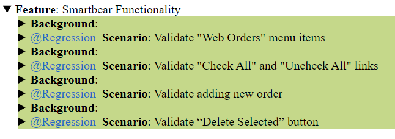
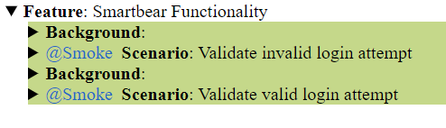

==========================   TEST RESULTS   ===========================

==========================   FRAMEWORK   ===========================
How the framework works:
This framework is testing the smartBear site. It consists of 6 scenarios.
This is a Behavior Driven Development (BDD) framework that is using Java together with Maven as a project management tool.
The scenarios in the feature file are categorize into separate suites using @Smoke and @Regression tags. Then those either of those tags can be executed in the Runner class. To do so, you must provide the CucumberOptions such as: feature which defines the path of the feature file, glue which define the path where the steps are being implemented, and tags which define which tag to execute.
To execute the specific suites with their tags using Maven commands is to go to the IDE terminal and run following commands: mvn test -Dcucumber.options="—tags @Regression" or mvn test -Dcucumber.options="—tags @Smoke".

